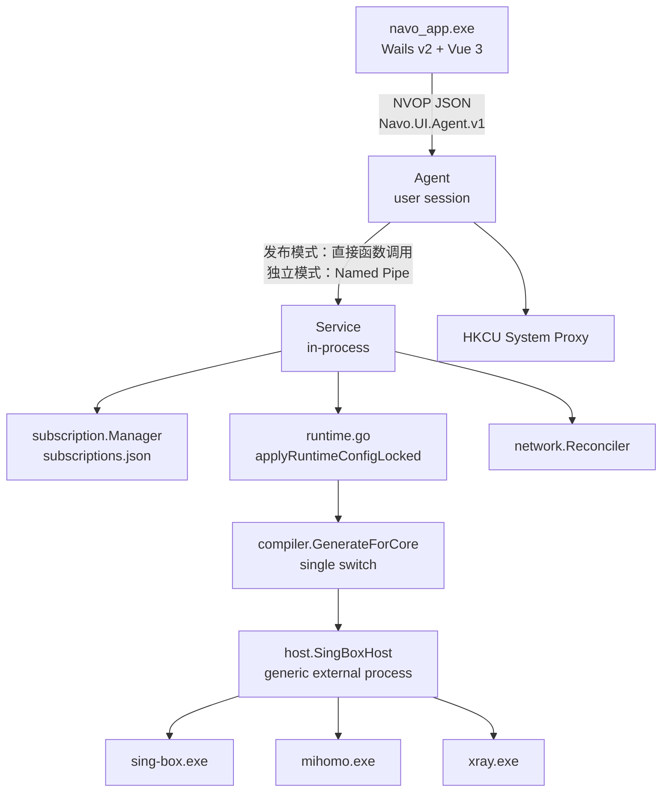
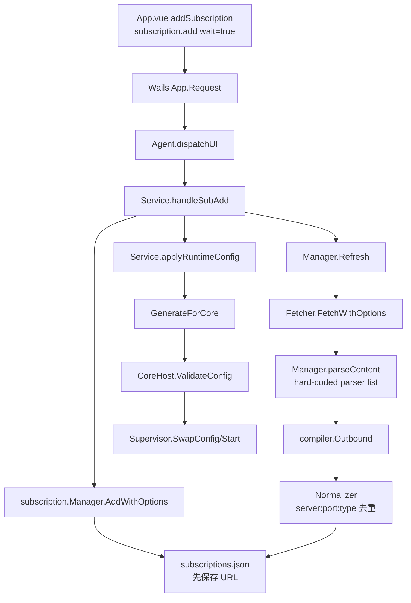
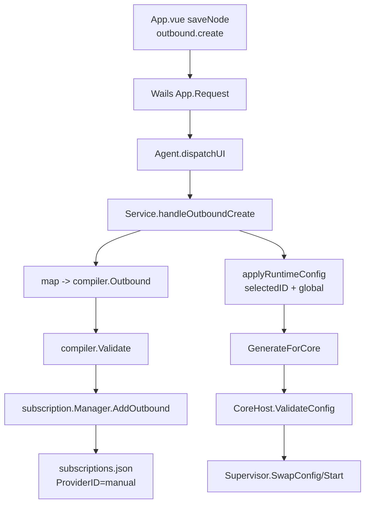

# Navo 当前状态审计

审计日期：2026-07-28  
审计范围：当前仓库、三个随附内核、现有构建与测试链  
执行约束：本文件完成后停止；未实施领域模型、CoreAdapter、MySQL 或 UI 重构

## 1. 结论

当前项目能完成 Wails 桌面构建、Go 测试、三内核 direct HTTP 基线，但尚未达到
多内核代理客户端的目标架构。机场订阅与手工 HTTP/SOCKS 代理都被存入同一个
`[]compiler.Outbound`，没有 `SourceType` 二选一、协议完整模型、版本化兼容性、
独立 CoreAdapter、真实连接事务或持久化 Last Known Good。

两个功能的共同故障面是：

```text
不完整/无类型输入
    -> 扁平 compiler.Outbound
    -> subscription.Manager 的同一个 JSON 集合
    -> Service.applyRuntimeConfigLocked
    -> compiler.Compatible（过度乐观）
    -> compiler.GenerateForCore（单 switch、不完整生成）
    -> 通用 SingBoxHost（sing-box 假设）
    -> 仅进程/单端口健康状态
```

因此，现有测试通过只能证明 direct 基线，不能证明机场或全链路代理可用。

## 2. 已确认的技术基线

- UI：Wails v2.12.0 + Vue 3.5.40，不再使用旧 UI 构建链。
- 控制层：Go 1.26.4。
- UI IPC：`Navo.UI.Agent.v1` Named Pipe，JSON frame。
- 发布运行：`navo.exe` 内嵌 Service、Agent；`navo_app.exe` 为 Wails 子进程。
- 数据库目标：用户云服务器中已有的 MySQL；Navo 只负责接入，不安装 MySQL。
- 当前持久化：JSON 文件，没有 SQLite，也没有 MySQL driver、Schema 或 migration。
- 内核：sing-box、Mihomo、Xray 均已存在。

架构执行说明已同步为 Wails + MySQL：
[`docs/design/Navo 多内核代理客户端架构改造与 Codex 执行说明.md`](../design/Navo%20多内核代理客户端架构改造与%20Codex%20执行说明.md)。

## 3. 当前目录树

```text
Navo/
├─ cmd/
│  ├─ navo/                    发布启动器：Service + Agent + Wails launcher
│  ├─ navo-agent/              独立 Agent 开发入口
│  ├─ navo-svc/                独立 Service 开发入口
│  └─ repair/                  网络检查/修复入口
├─ navo_app/
│  ├─ main.go                  Wails 窗口入口
│  ├─ app.go                   Wails -> Named Pipe bridge
│  └─ frontend/src/
│     ├─ App.vue               当前全部业务页面
│     └─ api.ts                通用 Request bridge
├─ internal/
│  ├─ agent/
│  │  └─ systemproxy/          WinINET 系统代理
│  ├─ compiler/                sing-box 模型 + 三内核 switch 生成器
│  ├─ health/                  CoreHost 定时健康检查（当前未接入 Service）
│  ├─ host/                    通用外部进程 host，仍以 sing-box 命名
│  ├─ ipc/                     未被生产链使用的 typed message 定义
│  ├─ network/                 TUN policy/journal/recovery
│  │  └─ tun/                 Wintun/route/DNS Windows 实现
│  ├─ pipe/                    Named Pipe frame transport
│  ├─ recovery/                第二套未接入 Service 的 recovery
│  ├─ securestore/             DPAPI machine-scope
│  ├─ service/                 IPC dispatch、运行时配置、核心切换
│  ├─ storage/                 JSON key-value store
│  ├─ subscription/            fetch、parse、normalize、JSON persistence
│  └─ supervisor/              核心进程状态机
├─ configs/
│  ├─ test_local.json
│  └─ test_tun.json
├─ third_party/
│  ├─ sing-box/
│  ├─ mihomo/
│  ├─ xray/
│  └─ wintun/
├─ scripts/
│  ├─ build.ps1
│  ├─ package.ps1
│  ├─ smoke.ps1
│  ├─ test.ps1
│  └─ clean.ps1
└─ docs/
   ├─ audit/
   ├─ design/
   └─ INSTALL_DEPLOY.md
```

缺少目标目录/文件：

- `internal/domain/`
- `internal/application/`
- `internal/adapters/core/{singbox,mihomo,xray}/`
- `internal/infrastructure/database/mysql/`
- `cmd/navo-core-host/`
- `configs/golden/{singbox,mihomo,xray}/`
- `CORE_MANIFEST.json`
- `THIRD_PARTY_NOTICES.md`
- `LICENSES/`

## 4. 当前运行架构



目标架构中的独立 Core Host 进程目前不存在。三个 core 由 Service 进程内的
通用 host 直接启动。

## 5. 所有入口

| 层 | 入口 | 当前职责 | 证据 |
|---|---|---|---|
| 发布启动器 | `cmd/navo/main.go:51` | 分配端口、写 bootstrap、构造 Service/Agent、启动 Wails | `service.New` 在 110-117；`agent.New` 在 135-140 |
| Wails UI | `navo_app/main.go:17` | 创建窗口、嵌入前端、绑定 `App` | `wails.Run` 在 26-44 |
| Wails bridge | `navo_app/app.go:24` | 将任意 method/payload 发给 Agent pipe | 43-73 |
| Vue UI | `navo_app/frontend/src/App.vue` | core/proxy/TUN/订阅/节点操作 | request 调用集中在 133-357 |
| Agent | `cmd/navo-agent/main.go:28` | 独立运行、系统代理命令 | `agent.New` 在 38-42 |
| Service | `cmd/navo-svc/main.go:34` | 独立运行、可传 core/config 路径 | flags 在 24-31 |
| Service dispatch | `internal/service/service.go:339` | map-based method switch | 343-437 |
| repair | `cmd/repair/main.go:22` | check/fix/reset；部分子命令未实现 | 31-54 |
| 内核生成 | `internal/compiler/multi_core.go:16` | 根据 coreID switch 生成配置 | 16-26 |
| 内核启动 | `internal/host/singbox.go:255` | validate、exec、等待端口 | 255-323 |

## 6. 机场订阅调用链



精确链路：

1. `App.vue:334` 发送 `subscription.add`，当前 UI 使用 `wait: true`。
2. `navo_app/app.go:24-73` 包装 map 并通过 `Navo.UI.Agent.v1` 发送。
3. `internal/agent/agent.go:330-350` 将请求转发给 Service。
4. `internal/service/service.go:796-841` 先保存订阅，再 fetch/parse/apply。
5. `internal/subscription/subscription.go:73-111` 将完整 URL 写入内存并保存。
6. `subscription.go:176-251` fetch、parse、normalize，再整体保存 outbounds。
7. `subscription.go:267-307` 以硬编码顺序尝试 Clash/URI parser。
8. `normalizer.go:15-46` 只按 `server:port:type` 去重。
9. `runtime.go:151-320` 把所有 outbounds 编译为当前内核配置。
10. `host/singbox.go:475-483` 调用当前 binary 的 native validator。
11. `supervisor/supervisor.go:141-164` 停旧进程、启动新进程。

失败/丢失点：

- Clash parser 是行扫描器，不是 YAML AST，嵌套字段、map/list、plugin 和未知字段会丢失。
- parser rejection 只进日志，不返回逐节点接受/拒绝报告。
- URL 和节点凭据进入明文 JSON。
- 多个不同凭据/Reality/transport 的同 server/port/type 节点可能被错误去重。
- 所有节点被压成扁平 `compiler.Outbound`，再进入不完整的 core generator。
- 切换/刷新没有 revision + post-start health commit。
- 非 wait 路径会在后台 apply 完成前返回成功。

## 7. 全链路 HTTP/SOCKS 调用链



精确链路：

1. `App.vue:306-308` 发送 `outbound.create/update`。
2. `internal/service/runtime.go:369-414` 从无类型 map 构造扁平 outbound。
3. 缺少协议时，`runtime.go:372-377` 自动默认为 SOCKS。
4. `runtime.go:415-425` 仅执行通用字段/少量协议校验。
5. `subscription.go:337-355` 以 `ProviderID=manual` 写入同一 outbounds 集合。
6. `runtime.go:429-439` 保存后立即切为 global 并激活。
7. 后续与机场完全共用 `applyRuntimeConfig -> GenerateForCore -> Host`。

当前不具备：

- 独立 `UpstreamProxy` aggregate。
- `SourceTypeUpstreamProxy` 与机场二选一约束。
- HTTPS upstream 的独立类型。
- `host:port`、`host:port:user:pass` 等批量导入器。
- 明确的 TCP/UDP capability 和 `UDPPolicy`。
- credential reference。
- 保存与激活分离。

## 8. Root Cause

根因不是 Wails，也不是某一个 parser 的单点 bug。根因是产品领域模型和运行事务缺失：

1. **没有单一活动选择**：`runtimeState` 只有 `CoreID`、`SelectedOutbound`、
   rule/global/direct、TUN 字段，没有 `SourceType` 与 `CaptureMode`。
2. **机场和上游代理共用扁平模型与集合**：二者无法由领域约束互斥。
3. **协议语义在 parser 边界被截断**：未知/嵌套字段无法进入后续兼容性判断。
4. **三个内核没有独立 Adapter**：生成、校验、启动、端口、健康和 capability
   分散在一个 switch 与一个 `SingBoxHost` 中。
5. **运行状态不是事务提交结果**：native config 合法后即可持久化选择；没有监听、
   controller、DNS、HTTP、egress、capture 全部通过后的 revision commit。
6. **持久化不能表达约束**：当前 JSON 没有 Schema、事务、外键、唯一约束或 LKG。

一个具体的跨内核错误是
`internal/host/singbox.go:666-703` 只查找 sing-box JSON 的 `"listen_port"`。
Mihomo `mixed-port` 和 Xray `port` 都得到 0；`waitForPort` 在
`singbox.go:608-612` 对 0 直接成功，`HealthCheck` 在 464-466 又把
`PortOK` 设为 true。这会产生虚假 running/healthy。

## 9. sing-box 强耦合

| 位置 | 耦合 |
|---|---|
| `CLAUDE.md` | 技术栈、目录和说明仍大量描述 sing-box/旧 UI，已过时 |
| `internal/compiler/model.go:1-3,160-162` | canonical Config 明确被定义为 sing-box source model |
| `internal/compiler/generator.go` | 完整实现只服务 sing-box |
| `internal/compiler/compiler.go` | interface、binaryPath、Check、扩展名都写死 sing-box |
| `internal/host/host.go:10-20` | CoreHost 注释和 config contract 写死 sing-box JSON |
| `internal/host/singbox.go` | 三个内核共用 `SingBoxHost` 类型和 sing-box 日志/错误文案 |
| `internal/service/service.go:75-88` | Service 强制要求 SingBoxPath，并优先 FindBinary |
| `internal/service/runtime.go:61-65` | Wintun 只从 sing-box 目录判断 |
| `internal/service/runtime.go:252-255` | 所有内核日志文件都叫 `sing-box.log` |
| `cmd/navo/main.go:91-116` | bootstrap 先生成 sing-box JSON，再构造 Service |
| `cmd/repair/main.go:98-105` | 只检查 sing-box，不检查另两内核 |

## 10. 简化节点模型及丢失字段

`internal/compiler/model.go:27-58` 的 `Outbound` 是当前唯一节点/上游结构。

已包含的部分字段：server、port、username/password、cipher、UUID、flow、
TLS、SNI、ALPN、uTLS fingerprint、ws path/host、gRPC serviceName、Reality
publicKey/shortID、Hysteria2 obfs、TUIC congestion。

缺少或表达不完整：

- 通用：typed protocol spec、raw/extension fields、credential reference、source ID、
  UDP policy、packet encoding、dial/detour、multiplex 完整参数。
- VMess：`alterId`、global padding、authenticated length、完整 transport/TLS 组合。
- VLESS/Reality：spiderX、mldsa65 verify、完整 flow/security 语义。
- Shadowsocks：plugin、plugin options、UDP over TCP、multiplex。
- Trojan：完整 transport headers、early data。
- WebSocket：early data header/name、完整 headers map。
- HTTPUpgrade：独立 transport 类型和 headers。
- gRPC：multi mode/idle/health 参数。
- Hysteria2：up/down bandwidth、hop ports、完整 TLS pinning。
- TUIC：UDP relay mode、heartbeat、zero RTT、timeout。
- WireGuard：private/public/pre-shared keys、peers、local addresses、reserved、
  MTU；当前只有 enum。
- 上游代理：HTTP/HTTPS 区分、TLS 配置、认证引用、UDP capability。

`ClashParser` 还会把 YAML list/map 压成字符串或直接忽略，导致模型“看似有字段”
也不代表真实保存了协议语义。

## 11. 三内核生成与兼容性

### sing-box

- `generator.go` 是当前最完整实现。
- `sing-box check -c` 已接入。
- 仍受扁平模型、明文配置、无 revision health commit 影响。

### Mihomo

- `multi_core.go:49-161` 用动态 map 生成 YAML-compatible JSON 数据。
- 输出实际是 JSON 文本且 runtime 文件扩展名仍为 `.json`。
- `Compatible` 对全部 outbound 返回 true。
- 缺 controller、secret、完整 DNS、完整规则/能力与版本矩阵。
- host 不识别 `mixed-port`，跳过 readiness。

### Xray

- `multi_core.go:164-264` 生成简化 JSON。
- mixed inbound 被转换为 HTTP port 与 `port+1` SOCKS；没有统一 PortPlan。
- 缺 TUN、DNS、policy、stats、API/controller。
- routing 被压成一条 final rule。
- `Compatible` 声称 WireGuard 可用，但 `xrayOutbound` 没有 WireGuard case。
- host 不识别 Xray `port`，跳过 readiness。

## 12. 系统代理、TUN、DNS、路由、端口、健康

### 系统代理

- Agent 实现：`internal/agent/systemproxy/`，修改 HKCU WinINET 并广播变化。
- Service 在 `service.go:439-458` 又直接调用同一 user-scope manager，职责重复。
- Agent 与 Service 都使用单一 `ProxyPort`，不从 core health result 获取真实 endpoint。
- backup 写到 `%TEMP%\navo\proxy_backup.json`，普通 disable 不 restore snapshot。
- Agent shutdown 调用 `Disable`，不是 `Restore`。
- 设置前不要求 core revision/端口/egress 全部通过。

### TUN

- runtime TUN：`runtime.go:239-260` 给 core config 增加 TUN inbound。
- UI enable：`service.go:652-701` 后台 apply 前就返回 `enabled`。
- status：`service.go:734-756` 用 Boolean 合成 route count，不读系统状态。
- 没有 `SupportsTUN(version)` capability；只硬编码禁止 Xray 切换的一种情况。
- `internal/network.Manager` 具备 journal、split-default route、NRPT、IPv6 policy，
  但生产 Service 没有构造/Activate/Deactivate 它。
- 当前同时存在 core 自建 TUN 与独立 Wintun manager 两套潜在所有权。

### DNS 与路由

- sing-box generator 可生成 DNS；Mihomo/Xray generator 不完整或没有 DNS。
- network manager 定义：
  - IPv4 `0.0.0.0/1`、`128.0.0.0/1`
  - NRPT `.` DNS leak protection
  - IPv6 tunnel/block/passthrough
- 上述 transactional manager 当前未进入实际连接链。
- 另一套 `tun/route_windows.go`、`dns_windows.go` 使用 `netsh/route` 文本解析，
  IPv6/locale/rollback 行为不完整。

### 端口

- 默认 mixed port：12080；launcher 在连续 100 个端口内寻找空闲端口。
- Mihomo：使用同一 mixed port。
- Xray：HTTP 使用 mixed port，SOCKS 使用 `mixed port + 1`，未单独检查冲突。
- controller/DNS port 没有统一规划。
- UI、Agent、Service、compiler、smoke 中都存在端口知识。

### 健康检查

- Host 启动：native validate + 进程 start + 单端口 TCP wait。
- Mihomo/Xray 因端口解析错误实际跳过 wait。
- `internal/health.Checker` 没有接入 Service/Supervisor。
- outbound test 只对远端 server:port 做 TCP connect，不验证代理协议或认证。
- 无 controller、SOCKS handshake、HTTP CONNECT、DNS、egress IP、capture state、
  revision 一致性检查。

## 13. 当前持久化与 MySQL 目标

### 当前状态

仓库没有 SQLite：

- `go.mod` 没有 SQL/MySQL driver。
- 没有 `database/sql` 使用。
- 没有 migration 或 Schema。
- `internal/storage/store.go` 是 JSON key-value store。
- `subscriptions.json` 保存订阅和全部 outbounds。
- `runtime_state.json` 保存 core、selected outbound、mode、TUN name/MTU。
- `ai-settings.json` 的 API key 使用 DPAPI，其他字段为 JSON。
- runtime native config 为 `runtime.<nanos>.json`。

### MySQL 接入边界

MySQL 位于用户现有云服务器，Navo 不安装数据库。后续实现必须满足：

```text
Wails UI -> Agent -> Service -> Repository interface -> MySQL adapter -> cloud MySQL
```

- 只有 Service infrastructure 持有连接配置。
- UI/Agent 不得拿到 DSN、密码或 CA private material。
- 强制 TLS server verification；禁止明文公网连接。
- 连接池必须设置 max open/idle/lifetime、connect/query timeout。
- migration 使用单独版本表与事务/锁，不能启动时并发重复执行。
- 数据写入失败不得改变 Active Revision。
- MySQL 暂时不可用时，已运行的 LKG core 不应被停止；UI 显示 degraded。
- 日志必须 redaction host credential、DSN、订阅 URL 和 endpoint secret。

建议目标表仍为：

```text
schema_migrations
core_installations
subscriptions
providers
endpoints
endpoint_specs
upstream_proxies
active_selection
core_revisions
core_runtime_events
compatibility_cache
system_proxy_snapshots
network_recovery_records
```

`active_selection` 必须有 singleton/unique 与机场/上游互斥约束；MySQL constraint
之外仍需领域校验。协议 spec 建议使用 typed columns + versioned JSON payload，
避免为追求“纯关系化”再次丢字段。

### 迁移风险

1. 当前 JSON 含明文 subscription URL 和凭据，迁移过程容易在日志/备份泄漏。
2. 现有 ID 由名称清洗生成，跨 provider 可能冲突。
3. 当前去重可能已经合并过不同节点，无法从 JSON 恢复丢失字段。
4. manual outbound 与机场节点在同一数组，只能依据 `ProviderID=manual` 尽力推断。
5. `runtimeState` 没有 SourceType，无法可靠推断时必须保持断开。
6. 云端 MySQL 网络失败不能导致正在工作的本地代理被停止。
7. 多台客户端连接同一库时需要 tenant/device ownership，不能共享 singleton。
8. 时钟、时区、字符集、collation、最大包和 JSON column 版本必须固定。
9. 迁移必须先只读扫描和备份，成功 commit 后才标记完成，不能删除原 JSON。

在实施 MySQL 前仍需用户提供：host、port、database、service account、TLS mode、
CA certificate/系统信任策略及是否多设备共享。不得把这些值提交到仓库。

## 14. IPC Contract

当前生产链使用 `map[string]interface{}`：

- Wails `App.Request` 接受任意 method/payload。
- Agent 用字符串白名单转发。
- Service 用字符串 switch 和手工 type assertion。

`internal/ipc` 虽定义 Envelope/消息，但没有被生产包导入，且已漂移：

- 缺 `core.select`、`outbound.select`、runtime、AI config 等当前方法。
- `CoreStartRequest` 允许 `config_path`。
- `ConfigCompileRequest` 允许任意 config object。
- 缺 `CoreType`、`SourceType`、`CaptureMode`、`ActiveSelection`、
  `CompatibilityResult`、revision/operation ID。

Named Pipe frame transport可复用：magic、长度边界、deadline、ACL、并发 instance
与 domain 无关。

## 15. Core Revision

有两套不完整状态：

1. `compiler.DefaultCompiler`
   - 内存中维护 revisions；
   - 写 `config_vN.json`；
   - 只用 sing-box check；
   - 没有被当前 `applyRuntimeConfig` 主链使用；
   - 重启后丢失。
2. `runtime.go`
   - 写单个 active runtime config 和 `runtime_state.json`；
   - 清理旧 runtime 文件；
   - swap 失败时可能仍保存 candidate 并返回成功；
   - 没有 validation/startup/health/LKG 状态。

当前没有 durable revision、content hash 全量记录、operation ID 或事务回滚记录。

## 16. 三个内核二进制

| Core | 版本 | 路径 | 大小 | SHA-256 |
|---|---|---|---:|---|
| sing-box | 1.13.14 | `third_party/sing-box/sing-box.exe` | 45,403,136 | `db0d779948214cf761011d154c3a5da36df20394fa01a9fc798f1dc39fe9d183` |
| Mihomo | v1.19.29 | `third_party/mihomo/mihomo.exe` | 47,440,384 | `4316ff91fecec2fca9acb5612d7400ba228c069ffd325b1f17f46f1d4ef7e0cd` |
| Xray | 26.3.27 | `third_party/xray/xray.exe` | 35,613,696 | `15c2d007954ac53ba69b80ec91242786b3c0b71d52649165b4ca1d5cc96ef8f1` |

存在的问题：

- 没有统一 `CORE_MANIFEST.json`。
- Service 只对文件存在性做 core list 判断，不校验 hash/version。
- `ValidateBinary` 仅为 sing-box version.txt/sha256 设计。
- Mihomo/Xray 有本地 LICENSE；sing-box 缺项目随附 LICENSE/NOTICE 记录。
- 包含 geo data/Wintun，但 manifest 未记录版本、来源、hash、validator 命令。

## 17. 错误、日志、明文与硬编码

### 错误

- Service 使用 `INVALID`、`SUB_001`、`CORE_002`、`NET_001` 等多套非稳定错误码。
- 没有统一 `AppError`、operation ID、revision ID、core/source context。
- async apply 错误只写 log，UI 已收到成功。
- 多处忽略错误：状态文件 JSON unmarshal、后台 apply、proxy notify、outbound remove save。

### 日志

- 没有统一 Redactor。
- subscription fetch transport error做了 URL stripping，是可复用基础。
- `subscription.list` 明文返回完整 URL。
- runtime config 含凭据；允许查看 core logs，但无统一敏感字段过滤。

### 硬编码

- port 12080、Xray `+1`。
- TUN name `Navo`、MTU 1500、address `172.19.0.1/30`。
- rule/global/direct 与默认 private/CN 规则。
- core ID/path、log 名 `sing-box.log`。
- core capability 与 Xray TUN special case。
- recovery path/schema 存在多套。

## 18. 可复用代码

保持并复用：

- `internal/pipe/`：Named Pipe frame、deadline、ACL、并发 listener。
- `internal/securestore/`：DPAPI primitive；后续扩展 credential reference。
- `internal/subscription/fetcher.go`：timeout/size/redirect/error URL stripping 基础。
- 各 URI parser 中经过 fixture 验证的解码逻辑，但输出必须改为 typed spec。
- `internal/network/manager.go` 的 journal/undo transaction 思路。
- `internal/network/platform_windows.go` 的权限与 Wintun hash preflight。
- `internal/agent/systemproxy/proxy_windows.go` 的 WinINET registry/notify primitive。
- Supervisor 的单操作 mutex/state event 基础思想。
- Wails `App.Request` 与 Vue UI shell；domain contract 冻结前不改页面。
- package/test/smoke 的 Wails 构建和隔离运行框架。

## 19. 必须重构的代码

| 模块 | 原因 | 目标 |
|---|---|---|
| `compiler.Outbound` | 扁平、明文、混合 source、丢字段 | typed EndpointSpec + UpstreamProxy |
| `subscription.Manager` | 同时管理订阅、manual outbound、JSON persistence | Subscription application service + repositories |
| `ClashParser` | 行扫描、静默丢字段 | 真正 YAML parser + report |
| `multi_core.go` | 一个 switch、兼容性过度乐观 | 三个独立 CoreAdapter |
| `DefaultCompiler` | sing-box-only、未进入主链 | 每 core native compiler/validator |
| `SingBoxHost` | 三 core 共用 sing-box 假设 | 独立 host adapter + Core Host boundary |
| `runtime.go` | source/capture/revision/health 事务缺失 | ApplySelection transaction |
| `service.go` dispatch | untyped map、任意 config path | typed IPC handlers |
| system proxy | Agent/Service 重复、disable 不 restore | Agent capture transaction |
| TUN/recovery | 多套实现、未接主链、虚假状态 | 单一 owner + reconciliation |
| JSON stores | 无 Schema/事务/约束 | Service repository + cloud MySQL adapter |
| error/logging | 非稳定错误码、无 redactor | AppError + structured logging |

## 20. 重复与死代码

- system proxy：Agent 与 Service 两处入口。
- recovery：`internal/network/reconciler`、`internal/recovery/reconciler`、
  host `Reconcile`、repair 自有逻辑。
- config revision：`DefaultCompiler` 与 runtime 文件逻辑两套。
- IPC contract：`internal/ipc` typed 定义与生产 map dispatch 两套。
- TUN：core TUN inbound、`network.Manager`、`tun.wintunManager` 三套所有权。
- `health.Checker` 当前没有 Service 接线。
- `storage.Store` 主要被 metrics 使用，不是业务数据库。

## 21. 测试现状

当前已执行并通过：

```text
scripts/test.ps1
  go test ./...  PASS
  go vet ./...   PASS

npm.cmd run build (navo_app)
  vue-tsc --noEmit  PASS
  vite build        PASS

scripts/package.ps1
  Go launcher/repair build  PASS
  Vue production build     PASS
  Wails windows/amd64      PASS
```

本轮 `scripts/smoke.ps1` 被交互中断，未作为本次审计的通过证据；测试创建的 Python
helper 已停止。仓库进度记录显示上一轮 direct smoke 曾通过，但它不覆盖本次目标。

现有 smoke 只覆盖：

- packaged startup 与 read-only IPC；
- direct outbound；
- sing-box/Mihomo/Xray core switch；
- 每个 core 的本地 HTTP data plane；
- stop/start/shutdown/residual process。

缺失测试：

- `ActiveSelection` 三选一/二选一。
- 每个 typed protocol parser 的完整字段 fixture。
- parser accepted/rejected report。
- core/version/capture compatibility matrix。
- 三个 native compiler golden。
- 三个 core 的 invalid-config native validator test。
- 六种 source/core 组合。
- mock HTTP CONNECT、HTTPS proxy、SOCKS5 auth/UDP。
- 系统代理 snapshot/restore 与崩溃恢复。
- 三 core TUN、DNS、UDP、IPv6、sleep/network change。
- MySQL migration、constraint、transaction rollback、TLS failure、disconnect。
- revision/LKG rollback。
- structured error mapping 与 redaction。
- Wails UI state/contract tests。
- Windows 11 VM kill/reboot/uninstall E2E。

## 22. 分阶段修改计划

### 阶段 0：审计

本文件。完成后停止，等待确认。

### 阶段 1：冻结领域模型

新增 `CoreType`、`SourceType`、`CaptureMode`、`ActiveSelection`、
typed `EndpointSpec`、`UpstreamProxy`、`CompatibilityResult`、`AppError`。
只写纯 Go domain 与单元测试，不改 UI、Service 运行链、数据库或 core。

### 阶段 2：抽取 sing-box Adapter

把现有可用 sing-box 生成/校验/启动逻辑收敛为 `SingBoxAdapter`，先保持行为。

### 阶段 3：Mihomo Adapter

原生 YAML、native validator、独立 port/controller/health、golden 和两种 source 测试。

### 阶段 4：Xray Adapter

原生 JSON、native validator、独立 HTTP/SOCKS/health、golden 和两种 source 测试。

### 阶段 5：Compatibility Resolver

按固定 core version + typed endpoint + capture mode 输出 reasons/warnings。

### 阶段 6：订阅模型

Fetcher metadata/cache、安全重定向；Parser Registry；完整字段；事务导入报告。

### 阶段 7：UpstreamProxy

HTTP/HTTPS/SOCKS5 typed model、文本导入、credential reference、TCP/UDP capability。

### 阶段 8：MySQL Repository 与 Active Selection 事务

- 增加 MySQL adapter、migration、repository contract。
- 只读导入现有 JSON，保留备份。
- 实现 source/core/capture 原子选择、candidate revision、LKG、rollback。
- MySQL 失败不停止已运行 LKG。

### 阶段 9：typed IPC 与 Wails UI

UI 只提交结构化 ID；展示 core/source/capture、兼容性、revision、真实状态和诊断。

### 阶段 10：系统代理、TUN 与恢复

先统一系统代理 transaction，再按 sing-box、Mihomo、Xray 顺序逐个完成并验证 TUN。

### 阶段 11：合规与交付

Core manifest、licenses/notices、package hashes、Win11 E2E、安装/卸载恢复文档。

## 23. 第一阶段建议文件

阶段 1 只新增以下文件，不移动现有稳定代码：

```text
internal/domain/core/type.go
internal/domain/core/type_test.go
internal/domain/source/type.go
internal/domain/source/type_test.go
internal/domain/capture/mode.go
internal/domain/capture/mode_test.go
internal/domain/selection/active_selection.go
internal/domain/selection/active_selection_test.go
internal/domain/endpoint/endpoint.go
internal/domain/endpoint/spec_shadowsocks.go
internal/domain/endpoint/spec_vmess.go
internal/domain/endpoint/spec_vless.go
internal/domain/endpoint/spec_trojan.go
internal/domain/endpoint/spec_hysteria2.go
internal/domain/endpoint/spec_tuic.go
internal/domain/endpoint/spec_wireguard.go
internal/domain/endpoint/spec_upstream.go
internal/domain/endpoint/validation_test.go
internal/domain/compatibility/result.go
internal/domain/apperror/error.go
```

阶段 1 明确不修改：

- `navo_app/`
- `internal/service/`
- `internal/subscription/`
- `internal/compiler/`
- `internal/host/`
- `internal/network/`
- `go.mod`
- MySQL/JSON 数据

领域模型及测试确认后，才进入 Adapter 与 persistence 实现。

## 24. 不得修改的现有稳定模块

在对应阶段到来前保持：

- `internal/pipe/` wire format 与 Windows ACL。
- `navo_app` Wails 构建链、窗口 class、package layout。
- `cmd/navo` 单实例、日志路径、Wails 启动/关闭 contract。
- `scripts/package.ps1` 的 Wails 打包与 SHA256SUMS。
- `scripts/test.ps1` 的 Go test/vet gate。
- 三个 `third_party/*/*.exe` 二进制本体。
- Wintun 固定 DLL 与 hash，直到 TUN adapter 阶段。
- 已加密的 AI settings 格式，除非有独立 migration。
- 用户当前 JSON 数据；只读备份/迁移，不得直接清空。
- 用户云端 MySQL 实例；不安装、不重置、不删除未知表。

## 25. 审计后的阻断点

开始阶段 1 前只需确认本审计结论。MySQL 连接参数不是阶段 1 的前置条件；
到阶段 8 前必须明确连接信息、TLS 信任策略和多设备/tenant 模型。

本审计没有修改业务代码、数据库、系统代理、TUN、路由或任何 core 二进制。
